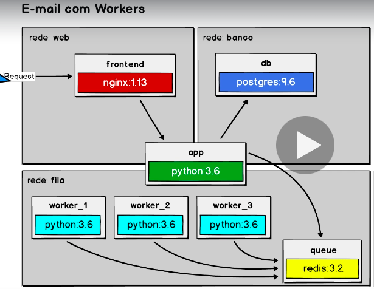

## Docker E-mail worker built with Nginx, Python, Redis and PostgreSQL - COD3R Cursos Udemy

### E-mail worker built with Nginx, Python, Redis and PostgreSQL, using Docker Compose to facilitate installation in any environment:

<p align="center">
  
</p>

### To install the application :

To use this application you will need to have Docker installed, Ok! For install this project after clone, use next steps:

```bash
$ docker-compose up -d
```
### To run the application:

After complete installation, verify if images are run in the your Docker:

```bash
$ docker ps
```
View this aplication at: http://localhost

View your file of the e-mails in: http://localhost/api

### Do you want to know more about my projects and career as a developer? Click on the link below and access my Linkedin.

  https://www.linkedin.com/in/alexgomesnet/

### License:

  [MIT](LICENSE)
